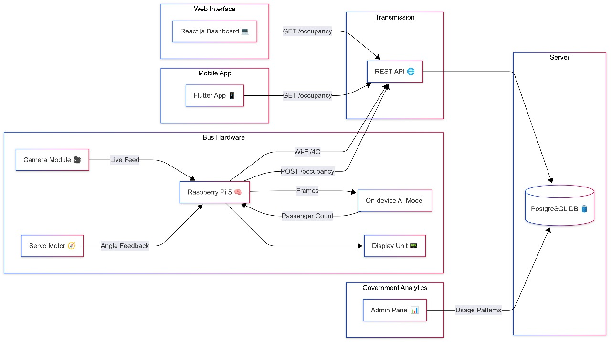

# SahYatri – Intelligent Public Transport Analytics Platform 🚍📡

*SahYatri* is an IoT-enabled transportation informatics system designed to optimize mass transit operations through real-time passenger density analytics. This comprehensive solution integrates embedded edge computing, computer vision, and full-stack web/mobile interfaces to provide actionable insights for transit authorities and commuters.

---

## 🌐 Architectural Overview

SahYatri comprises multiple modular components, each in its dedicated repository, working synergistically to monitor and analyze passenger distribution in public transit vehicles:

| Component | Description |
|-----------|-------------|
| [SahYatri-3DModel](https://github.com/yasharth-0910/SahYatri-3DModel) | Ergonomic enclosure design for edge computing unit |
| [SahYatri-Hardware](https://github.com/yasharth-0910/SahYatri-Hardware) | Embedded system implementation for data acquisition |
| [SahYatri-DetectionAI](https://github.com/yasharth-0910/SahYatri-DetectionAI) | Computer vision pipeline for passenger flow analysis |
| [SahYatri-BusApi](https://github.com/yasharth-0910/SahYatri-BusApi) | Distributed systems backend for data aggregation |
| [SahYatri-Website](https://github.com/yasharth-0910/SahYatri-Website) | Operational intelligence dashboard |
| [SahYatri-MobileApp](https://github.com/yasharth-0910/SahYatri-MobileApp) | Passenger-facing mobility application |

---

## 🏗️ System Architecture

1. *Edge Node* captures visual data streams  
2. *Vision Processing Unit* analyzes spatial distribution  
3. *Analytics Engine* computes:
   - Current capacity utilization
   - Historical load patterns
   - Predictive crowding forecasts  
4. Data is:
   - Visualized locally via HMI interface
   - Transmitted to cloud-based data warehouse
   - Disseminated through web and mobile interfaces

---

## 🛠️ Technical Implementation

### Edge Computing Unit
- Raspberry Pi 4 with custom 3D-printed enclosure
- High-efficiency camera module
- I²C LCD interface for local monitoring
- Automated image processing pipeline

### Computer Vision System
- Optimized YOLOv5n convolutional neural network
- Real-time object detection at 15 FPS
- Dynamic density calculation algorithms
- Adaptive thresholding for varying lighting conditions

### Data Infrastructure
- Node.js/Express RESTful API
- PostgreSQL time-series database
- Redis caching layer
- Websocket-based real-time updates

### Visualization Interfaces
- React-based operational dashboard
- Responsive mobile application
- Administrative analytics portal
- Public information displays

---

## 🌍 Societal Impact

This system contributes to several United Nations Sustainable Development Goals:

🎯 *SDG 9* - Industry, Innovation and Infrastructure  
🔹 Implementing smart infrastructure solutions  
🔹 Promoting technological innovation in public transit  

🎯 *SDG 11* - Sustainable Cities and Communities  
🔹 Enhancing urban mobility efficiency  
🔹 Reducing transit-related energy consumption  

🎯 *SDG 17* - Partnerships for the Goals  
🔹 Facilitating public-private collaborations  
🔹 Creating open-source mobility solutions  

---

## 🧩 System Design

