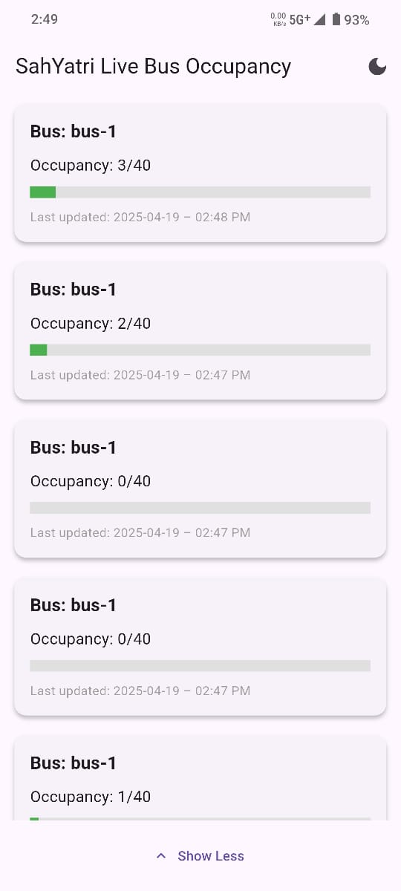
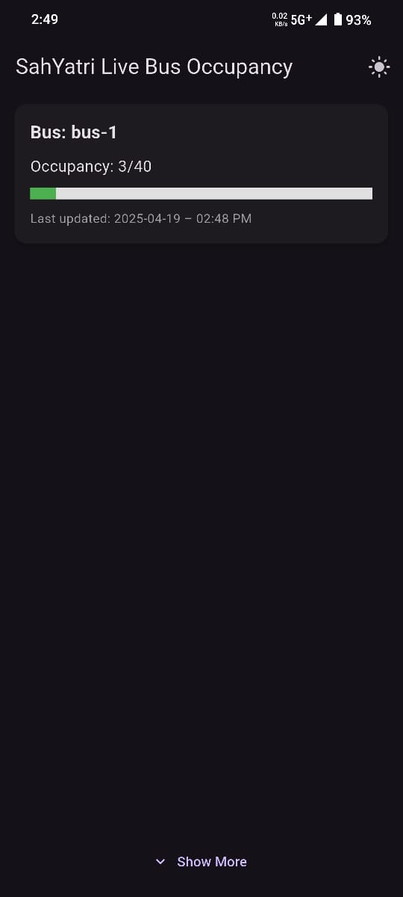
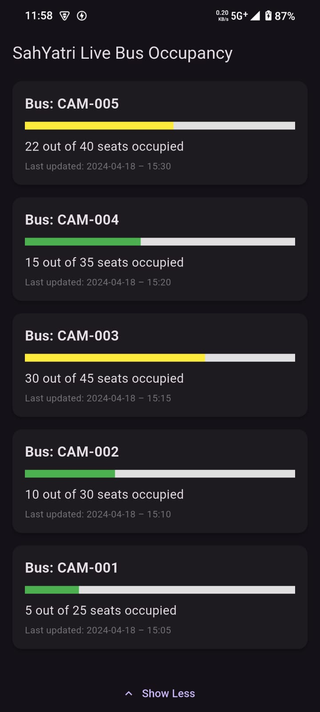

# 🚍 SahYatri - Live Bus Occupancy App

SahYatri is a Flutter-based Android application that displays **real-time bus occupancy data** using a clean, user-friendly interface. It fetches data from an API and presents it with useful features like color-coded occupancy bars, dark/light theme toggle, refresh control, and animated list expansion.

---

## 🌟 Features

- 📊 **Live Occupancy Data**: Displays live data for each bus, including total capacity and current occupancy.
- 🎨 **Dark/Light Mode**: Toggle between light and dark themes for a better viewing experience.
- 📶 **Offline Handling** *(optional)*: Displays fallback data if the app goes offline.
- 🔁 **Pull to Refresh**: Swipe down to fetch the latest bus occupancy data.
- 📈 **Animated Show More / Show Less**: Smoothly expand or collapse older bus entries.
- 🧠 **Intelligent UI**:
  - Occupancy bar changes color (green/red) based on fullness.
  - Only the latest entry is shown by default for live buses (e.g., Bus-1).
  - Static demo entries are always visible.

---

## 📱 Screenshots

<p align="center">
  
  
  
</p>

---

## 🛠️ Tech Stack

- Flutter (Dart)
- REST API (JSON)
- Material Design
- `intl` package for date formatting

---

## 🚀 Getting Started

### 🔧 Prerequisites

- [Flutter SDK](https://flutter.dev/docs/get-started/install)
- Android Studio or VS Code (with Flutter/Dart plugins)
- An emulator or Android device

### 🔄 Installation Steps

1. **Clone the repository:**
   ```bash
   git clone https://github.com/yourusername/sahyatri-live-bus-occupancy.git
   cd sahyatri-live-bus-occupancy
